---
.main-title
# Intro to R
# and
# Exploratory Graphics

---

## 👋, I'm Mark Sonnabaum

### [@msonnabaum](http://twitter.com/msonnabaum)

---

## Performance engineer at 

---

## Not a statistician

---

## Not a data scientist

---
.image


---

## Anscombe's quartet


---


|set |   mean y| mean x|     sd y|     sd x|
|:---|--------:|------:|--------:|--------:|
|1   | 7.500909|      9| 2.031568| 3.316625|
|2   | 7.500909|      9| 2.031657| 3.316625|
|3   | 7.500000|      9| 2.030424| 3.316625|
|4   | 7.500909|      9| 2.030578| 3.316625|


---
.code

 

---
.title
# Exploratory Data Analysis

---
.image

# John Tukey


---
.tall-image


---


## Data visualization is
## not just **presentation**

---

## Data visualization is
## part of the **analysis process**

---

## Is this dataset correct?

## Be skeptical

<!-- talk about exploring the dataset to check it, maybe find quick example to show of a viz that would have otherwise been used? -->

---

## Formulate a question

## Make a basic plot, iterate
## Refine the question

<!-- Your first instinct will often be wrong -->

---

## Can the question be answered with this data?

---

## Visualization needs
## to be **fast**

---
.quote

> In my experience, when you're doing a data analysis, the biggest bottleneck is cognitive.

<cite>Hadley Wickham</cite>

---

# **R**

### Language/environment for statistical computing and graphics

---

## Why learn a new language?

### Interactivity
### Two-dimensional data structures
### Graphics output
### Community
<!--

matrix data structures

matrix/vector operations

huge std lib

python - pandas
-->

<!-- Maybe expand on each -->

---

## R + Hadleyverse

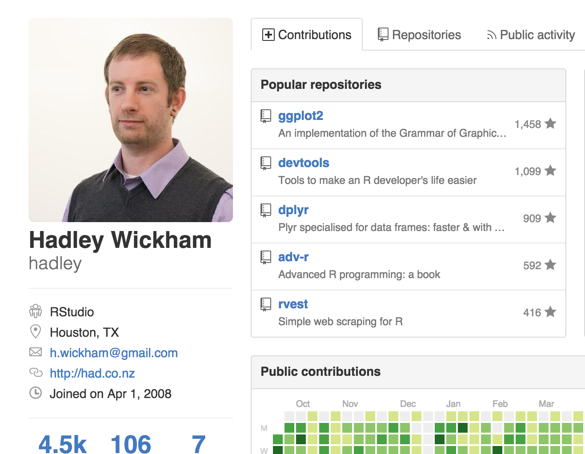

---

# Install

```sh
brew cask install r
```

---
.image


---

<!-- TODO: change this to a 2-column layout with right as a list -->
# Rstudio

### Built in editor, console, plot viewer
### Rmarkdown support, publish to rpubs

---
.image


---
.title2
# R Basics

---

# Vector

###  multi-value of same type

---
.bigcode

```r
a <- c(1,2,3,4)
b <- c("a", "b", "c", "d")
```
---

# Data frame

### two-dimensional (matrix)
### named vectors of equal length

<!-- matrix with named columns each column can be different type -->

---
.bigcode

```r
a <- c(1,2,3,4)
b <- c("a", "b", "c", "d")

data.frame(var1 = a, var2 = b)
```

```
##   var1 var2
## 1    1    a
## 2    2    b
## 3    3    c
## 4    4    d
```

---

# Vectorized functions

---
.bigcode

```r
floor(1.5)
```

```
## [1] 1
```

```r
floor(c(1.5, 3.9))
```

```
## [1] 1 3
```

---

# Functions as values

---
.bigcode

```r
addFive <- function(x) {
  x + 5
}

addFive(10)
```

```
## [1] 15
```

---
.title
# Reading Data

---

## Two-dimensional format

## **CSV** or **TSV**

---

## Avoid **JSON**
### or flatten first: https://gist.github.com/msonnabaum/131ac2315e578d583afa

---

### varnish-stat.csv

<!-- TODO: Maybe change this to be a table -->

```bash
time,client_conn,client_req,cache_hit
1424123710,46,25,0
1424123711,47,52,2
1424123712,48,62,2
1424123713,49,63,2
1424123714,49,65,2
```

---
.code

```r
varnish_df <- read.csv("varnish-stat.csv")
plot(varnish_df$client_conn ~ varnish_df$time, type = "l")
```

 

---

### access.log
```bash
127.0.0.1 - - [12/Oct/2013:13:41:57 -0600] "GET /core/modules/shortcut/css/shortcut.icons.css HTTP/1.1" 200 499
127.0.0.1 - - [12/Oct/2013:21:25:25 -0500] "GET / HTTP/1.1" 200 9385
```

---
.code


```r
library("webreadr")

log_df <- read_clf("access.log")
str(log_df)
```

```
## Classes 'tbl_df', 'tbl' and 'data.frame':	3 obs. of  7 variables:
##  $ ip_address       : chr  "127.0.0.1" "127.0.0.1" ""
##  $ remote_user_ident: chr  NA NA NA
##  $ local_user_ident : chr  NA NA NA
##  $ timestamp        : POSIXct, format: "2013-10-12 19:41:57" "2013-10-13 02:25:25" ...
##  $ request          : chr  "GET /core/modules/shortcut/css/shortcut.icons.css HTTP/1.1" "GET / HTTP/1.1" NA
##  $ status_code      : int  200 200 NA
##  $ bytes_sent       : int  499 9385 NA
##  - attr(*, "problems")=Classes 'tbl_df', 'tbl' and 'data.frame':	1 obs. of  4 variables:
##   ..$ row     : int 3
##   ..$ col     : chr NA
##   ..$ expected: chr "7 columns"
##   ..$ actual  : chr "1 columns"
```
---
.title3
## Dataset terminology

---

## columns = variables
## rows    = observations

---
.title3
## Variable types

---

## Continuous


```r
c(1, 2, 3, 4, 5)
```

```
## [1] 1 2 3 4 5
```


```r
seq(as.POSIXct("2012-05-21"), by=("+1 hour"), length.out=5)
```

```
## [1] "2012-05-21 00:00:00 CEST" "2012-05-21 01:00:00 CEST"
## [3] "2012-05-21 02:00:00 CEST" "2012-05-21 03:00:00 CEST"
## [5] "2012-05-21 04:00:00 CEST"
```

---

## Categorical/Discrete

```r
c("A", "B", "C", "D")
```

```
## [1] "A" "B" "C" "D"
```

---
.title
# Basic plots

---
.code

```r
head(requests_df)
```

```
##               Agent Total.Time Success Status            datetime
## 1 Sydney, Australia       4.66       1     OK 2013-04-01 20:18:56
## 2      San Jose, CA       4.59       1     OK 2013-03-27 03:49:00
## 3   London, England       4.02       1     OK 2013-03-23 09:43:55
## 4 Sydney, Australia       4.78       1     OK 2013-03-30 00:23:54
## 5 Sydney, Australia       4.58       1     OK 2013-03-27 14:43:54
## 6 Sydney, Australia       5.12       1     OK 2013-03-29 01:33:56
```
---

## 1 continuous variable

---
.code

```r
requests_df %>%
  ggplot(aes(Total.Time)) +
  geom_histogram(binwidth=0.2) +
  geom_rug()
```

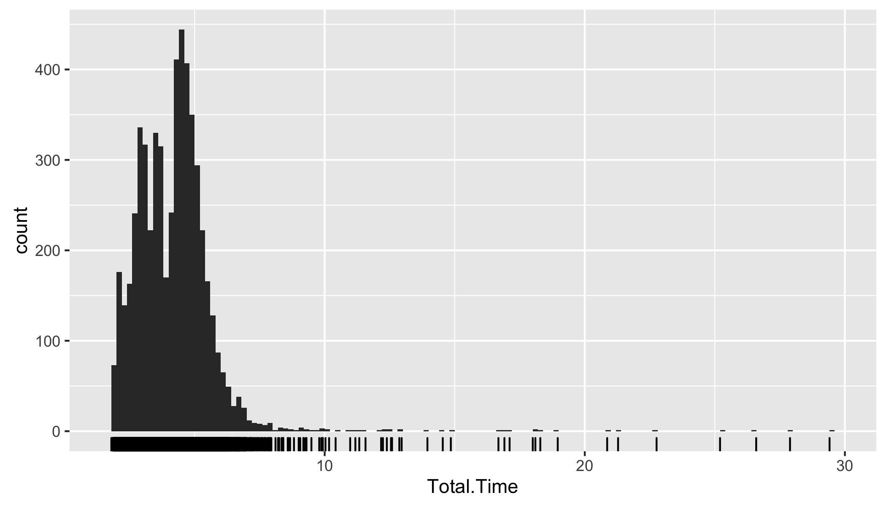 

---

## 2 continuous variables

---
.code

```r
ggplot(requests_df, aes(datetime, Total.Time)) +
  geom_line()
```

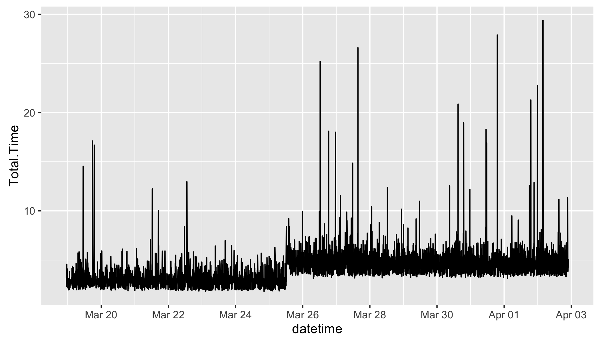 

---
.code

```r
ggplot(requests_df, aes(datetime, Total.Time)) +
  geom_point(alpha = 0.2)
```

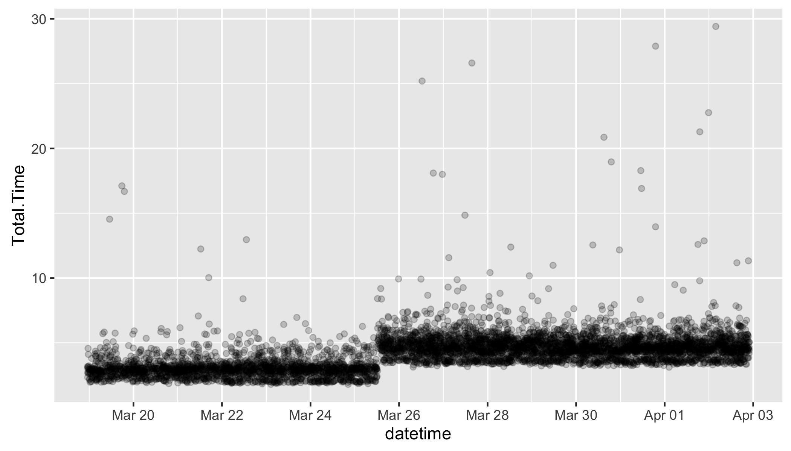 

---

## 1 continuous variable,
## 1 categorical variable

---
.code

```r
ggplot(requests_df, aes(Agent, Total.Time, colour=Agent)) +
  geom_boxplot() + theme(legend.position="none")
```

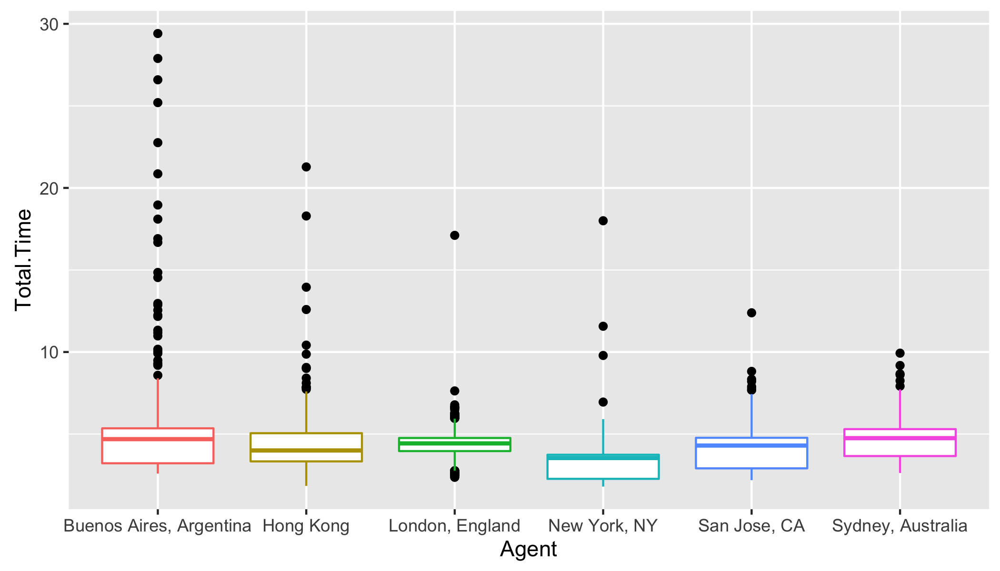 

---

## 2 continuous variables,
## 1 categorical variable

---
.code

```r
ggplot(requests_df, aes(datetime, Total.Time, colour=Agent)) + 
 geom_line(alpha = 0.44)
```

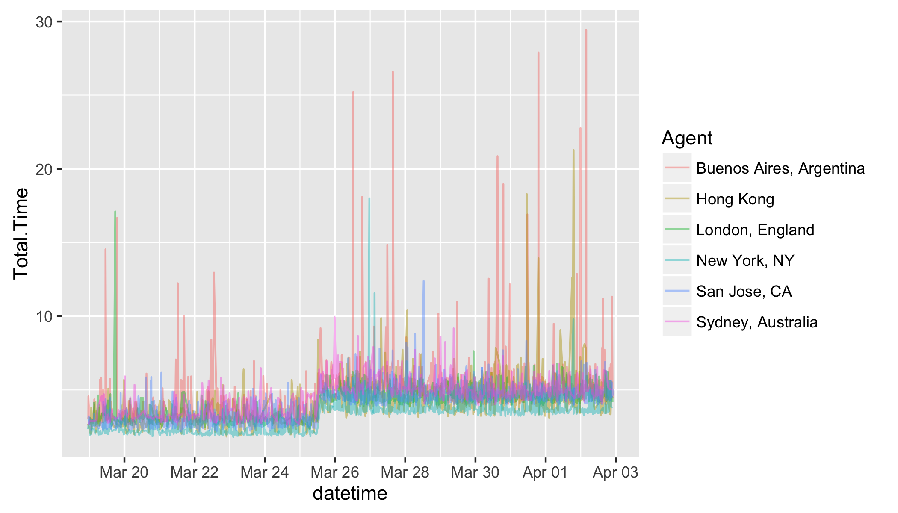 

---

## 2 continuous variables,
## 2 categorical variable

---
.code


```r
ggplot(requests_df, aes(datetime, Total.Time,
                        colour=Agent, alpha=0.4)) +
  geom_line() +
  facet_wrap(~Agent) + theme(legend.position="none")
```

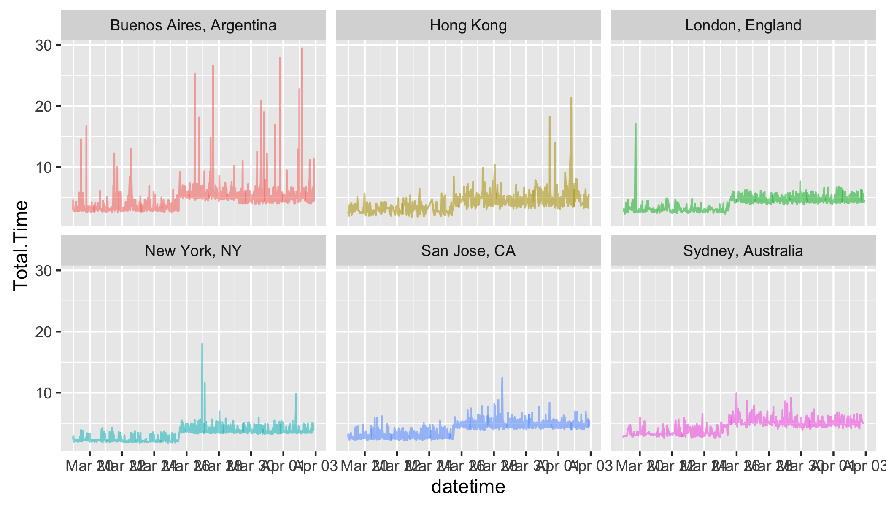 

<!--


# 3 continous variables


heatmap

moving histogram
-->

---
.title
# Data tidying

---
.code

```r
library("tidyr")

head(varnish_df)
```

```
##         time client_conn client_req cache_hit
## 1 1424123710          46         25         0
## 2 1424123711          47         52         2
## 3 1424123712          48         62         2
## 4 1424123713          49         63         2
## 5 1424123714          49         65         2
```

```r
df_long <- gather(varnish_df, metric, value, -time)

head(df_long)
```

```
##         time      metric value
## 1 1424123710 client_conn    46
## 2 1424123711 client_conn    47
## 3 1424123712 client_conn    48
## 4 1424123713 client_conn    49
## 5 1424123714 client_conn    49
## 6 1424123710  client_req    25
```

---
.code

```r
ggplot(df_long, aes(x=time, y=value, colour=metric)) +
  geom_line()
```

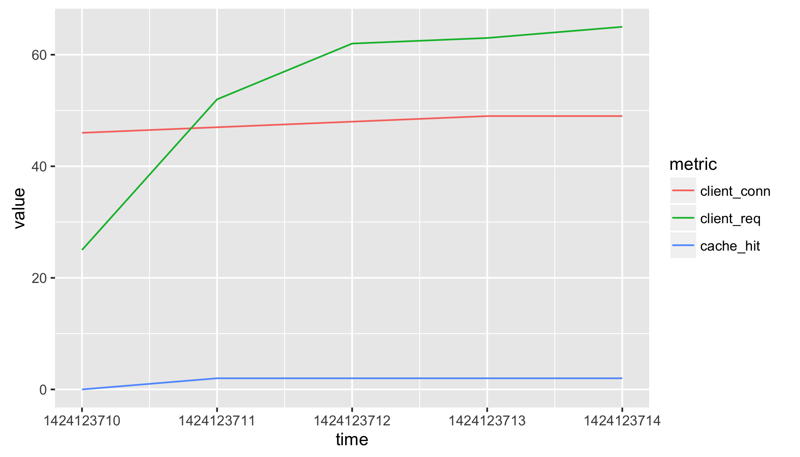 


---
.code


```r
head(df_with_ms, 2)
```

```
##         time      metric value
## 1 1424123710 client_conn  46ms
## 2 1424123711 client_conn  47ms
```

```r
df_extracted <- extract(
  df_with_ms,
  value,
  c("value", "unit"),
  "([0-9]+)(.*)"
)

head(df_extracted, 2)
```

```
##         time      metric value unit
## 1 1424123710 client_conn    46   ms
## 2 1424123711 client_conn    47   ms
```

---
.title

# Data manipulation

---
.title2
# dplyr


---

## Works with
- data frames
- data tables
- SQLite
- PostgreSQL/Redshift
- MySQL/MariaDB
- Bigquery
- MonetDB (via MonetDB.R)

---
.title3
# Pipe operator

# %>%

---


```r
head(select(filter(requests_df, Status == "OK"), Total.Time))
```
  ==

```r
requests_df %>%
  filter(Status == "OK") %>%
  select(Total.Time) %>%
  head
```

---
.title2

# Filter

---
.code

```r
requests_df %>%
  filter(Agent == "New York, NY") %>%
  filter(datetime > as.POSIXct("2013-03-24") &
         datetime < as.POSIXct("2013-04-02")) %>% 
  ggplot(aes(datetime, Total.Time)) +
  geom_line()
```

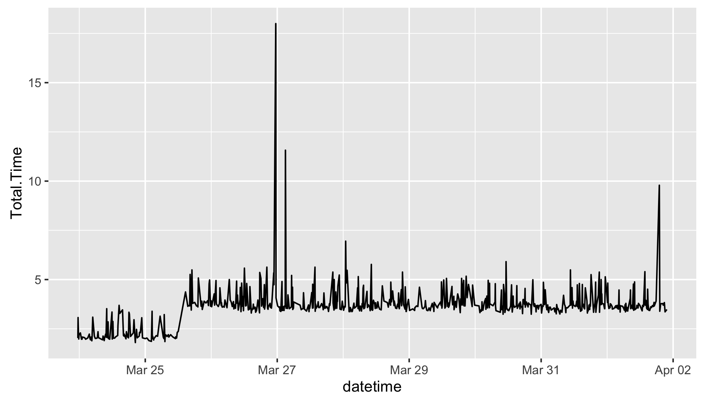 

---
.title2

# Group By / Summarise

---
.code

```r
requests_df %>% 
  filter(!is.na(Total.Time)) %>% 
  group_by(Agent) %>% 
  summarise(
    median = median(Total.Time),
    `95th` = quantile(Total.Time, 0.95),
    `99th` = quantile(Total.Time, 0.99),
    `99.9th` = quantile(Total.Time, 0.999)
  )
```

```
## Source: local data frame [6 x 5]
## 
##                     Agent median   95th    99th   99.9th
##                    (fctr)  (dbl)  (dbl)   (dbl)    (dbl)
## 1 Buenos Aires, Argentina   4.69 6.7700 13.6552 27.68720
## 2               Hong Kong   4.00 6.7430  9.5541 19.66839
## 3         London, England   4.43 5.7100  6.2085  7.61725
## 4            New York, NY   3.54 4.8200  5.4740 11.42760
## 5            San Jose, CA   4.30 5.6985  6.9082  8.72256
## 6       Sydney, Australia   4.75 6.5420  7.8440  9.52650
```

---
.title2

# Mutate

---
.code

```r
requests_df %>%
  mutate(Total.Time.ms = Total.Time * 1000) %>% 
  ggplot(aes(Total.Time.ms)) +
  geom_histogram(binwidth=100)
```

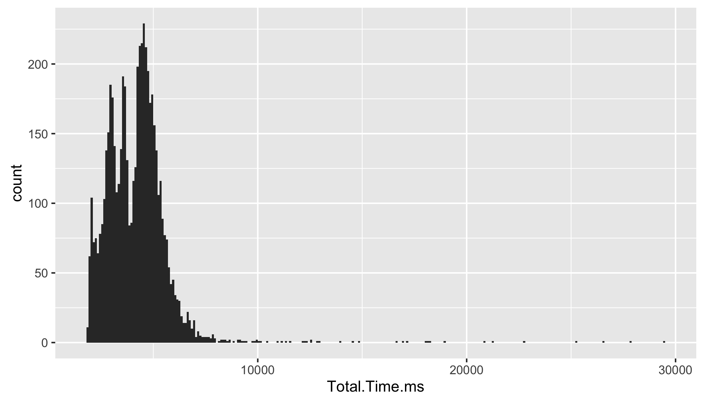 

---
.title

# Summary Statistics

---
.title2

## mean
## /
## standard deviation
---
.bigimage


---
.code

 

---

## **Do not use** unless you know
## data is **normally distributed**

---
## Five-number summary

1. min
2. lower quartile
3. median
4. upper quartile
5. max

---
.bigcode

```r
summary(multimode_df$request_time_ms)
```

```
##    Min. 1st Qu.  Median    Mean 3rd Qu.    Max. 
##   7.334   9.299  12.320  25.560  39.440 147.500
```

---
.code

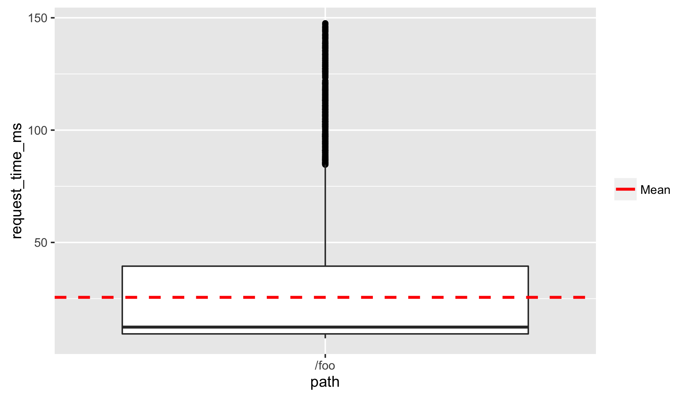 

---
.image

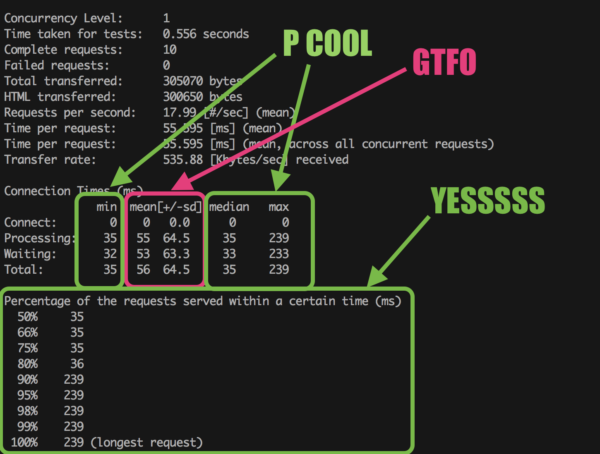

---
.code

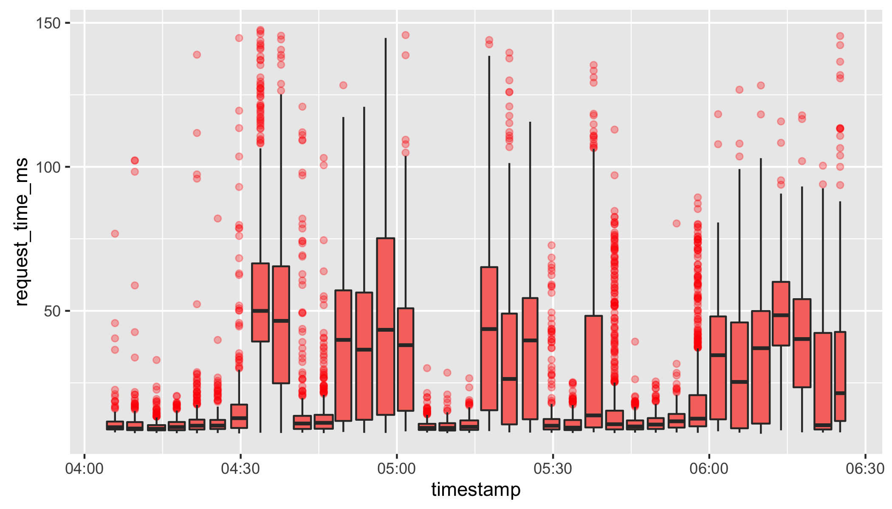 

---
.code

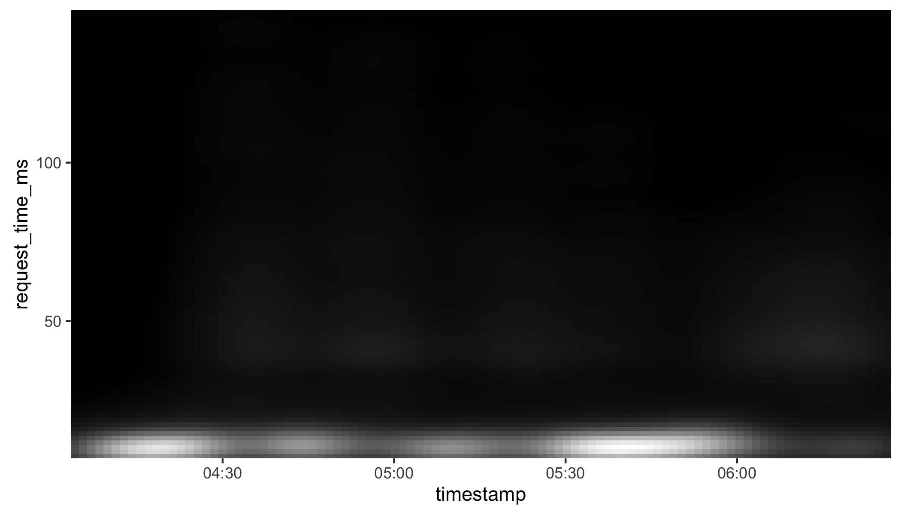 


---
.title

# Presentation

---
.title3
## R markdown

---
.image


---
.image


---

## ggvis

---

# Further reading

[Exploratory Data Analysis with R](https://leanpub.com/exdata) - Roger Peng

[The Art of Data Science](https://leanpub.com/artofdatascience) - Roger Peng


---
.references
# References

- https://github.com/hadley/dplyr
- https://github.com/hadley/tidyr
- https://github.com/hadley/ggplot2
- https://github.com/rstudio/ggvis
- https://github.com/Ironholds/webreadr

---
# THANKS

---

