---
.main-title
# Intro to R
# and
# Exploratory Graphics

---

## 👋, I'm Mark Sonnabaum

### [@msonnabaum](http://twitter.com/msonnabaum)

---

### Performance engineer at [Acquia](//acquia.com)

### Not a statistician

### Not a data scientist

### Works with data regularly

---
.title
# Exploratory graphics

---

## Anscombe's quartet


---

    set sd y     mean y   sd x     mean x
    1   2.031568 7.500909 3.316625 9
    2   2.031657 7.500909 3.316625 9
    3   2.030424 7.500000 3.316625 9
    4   2.030579 7.500909 3.316625 9

---
.code

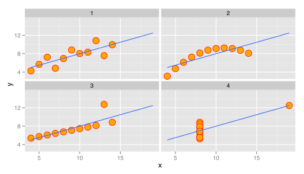 

---

## Data visualization is
## not just **presentation**

---

## Data visualization is
## **part of the analysis process**

---
.quote

> In my experience, when you're doing a data analysis, the biggest bottleneck is cognitive.

<cite>Hadley Wickham</cite>

---

## Visualization needs
## to be **fast**

---

# R

### Language and environment for statistical computing and graphics

---

## Why learn a new language?

---

### Many multi-value data types
#### (vector, matrix, list, data frame)

### Functions as values

---

### R

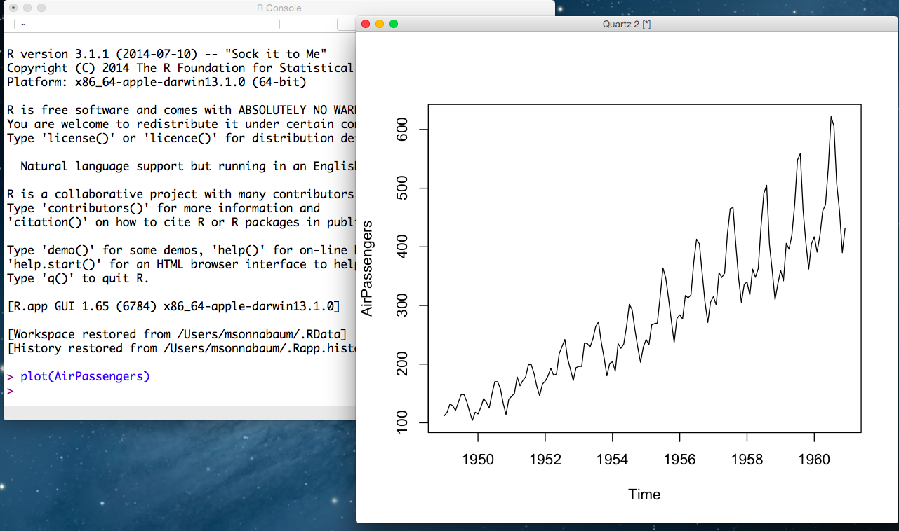

---

# Rstudio

### Built in editor, console, plot viewer
### Rmarkdown support, publish to rpubs

---
.image


---
.title

# R Data structures

---

# Vector

###  multi-value of same type

---
.code

```r
a <- c(1,2,3,4)
b <- c("a", "b", "c", "d")
```
---

# Data frame 

### two-dimensional, named vectors of equal length

---
.code

```r
a <- c(1,2,3,4)
b <- c("a", "b", "c", "d")

data.frame(var1 = a, var2 = b)
```

```
##   var1 var2
## 1    1    a
## 2    2    b
## 3    3    c
## 4    4    d
```

---
.title
# Data preperation

---
## Get data into 
## two-dimensional format

### CSV or TSV

### Avoid JSON*

---

### varnish-stat.csv
```csv
time,client_conn,client_req,cache_hit
1424123710,46,25,0
1424123711,47,52,2
1424123712,48,62,2
1424123713,49,63,2
1424123714,49,65,2
```

---
.code

```r
read.csv("varnish-stat.csv")
```

```
##         time client_conn client_req cache_hit
## 1 1424123710          46         25         0
## 2 1424123711          47         52         2
## 3 1424123712          48         62         2
## 4 1424123713          49         63         2
## 5 1424123714          49         65         2
```
---
.code

```r
library("ggplot2")
varnish_df <- read.csv("varnish-stat.csv")
ggplot(varnish_df, aes(x=time, y=client_conn)) +
  geom_line()
```

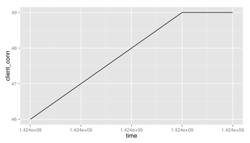 

---

## Dataset terminology

---

## columns = variables
## rows    = observations

---

## Variable types

---

## continuous
## categorical/discrete

---
.title
# Basic plots


---
.code

```r
head(requests_df)
```

```
##                     Agent Total.Time Success Status            datetime
## 1         London, England       4.33       1     OK 2013-04-01 14:58:55
## 2               Hong Kong       3.16       1     OK 2013-03-27 15:48:54
## 3            New York, NY       3.31       1     OK 2013-04-01 21:53:54
## 4            New York, NY       3.54       1     OK 2013-03-27 17:18:55
## 5 Buenos Aires, Argentina       4.44       1     OK 2013-03-30 09:18:55
## 6            New York, NY       3.72       1     OK 2013-03-29 15:48:56
```
---

## 1 continuous variable

---
.code

```r
requests_df %>%
  ggplot(aes(Total.Time)) +
  geom_histogram(binwidth=0.2)
```

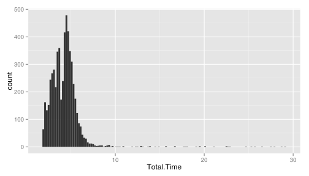 

---

## 2 continuous variables

---
.code

```r
ggplot(requests_df, aes(datetime, Total.Time)) +
  geom_line()
```

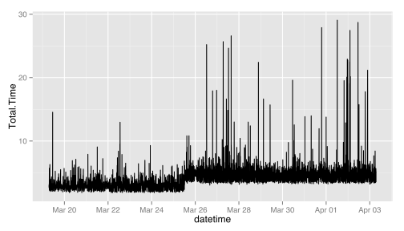 

---
.code

```r
ggplot(requests_df, aes(datetime, Total.Time, alpha=0.4)) +
  geom_point()
```

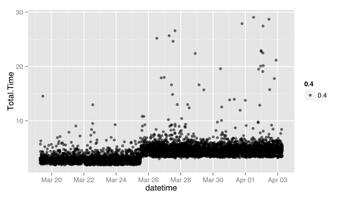 

---

## 1 continuous variable,
## 1 categorical variable

---
.code

```r
ggplot(requests_df, aes(Agent, Total.Time, colour=Agent)) +
  geom_boxplot() + theme(legend.position="none")
```

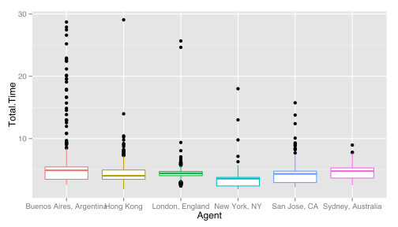 

---

## 2 continuous variables,
## 1 categorical variable

---
.code

```r
ggplot(requests_df, aes(datetime, Total.Time,
                        colour=Agent, alpha=0.4)) +
  geom_line()
```

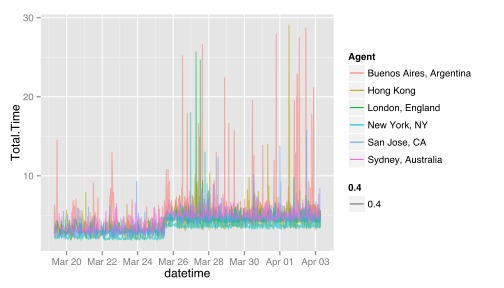 

---

## 2 continuous variables,
## 2 categorical variable

---
.code


```r
ggplot(requests_df, aes(datetime, Total.Time,
                        colour=Agent, alpha=0.4)) +
  geom_line() +
  facet_wrap(~Agent) + theme(legend.position="none")
```

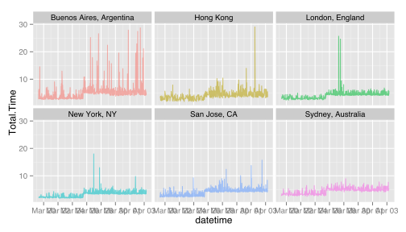 

---
.title
# Data tidying

---
.code

```r
library("tidyr")

head(varnish_df)
```

```
##         time client_conn client_req cache_hit
## 1 1424123710          46         25         0
## 2 1424123711          47         52         2
## 3 1424123712          48         62         2
## 4 1424123713          49         63         2
## 5 1424123714          49         65         2
```

```r
df_long <- gather(varnish_df, metric, value, -time)

head(df_long)
```

```
##         time      metric value
## 1 1424123710 client_conn    46
## 2 1424123711 client_conn    47
## 3 1424123712 client_conn    48
## 4 1424123713 client_conn    49
## 5 1424123714 client_conn    49
## 6 1424123710  client_req    25
```

---
.code

```r
ggplot(df_long, aes(x=time, y=value, colour=metric)) +
  geom_line()
```

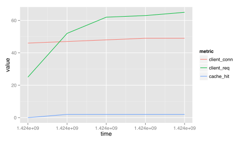 

---
.title

# Data manipulation

---
.title2
# dplyr


---

## Works with
- data frames
- data tables
- SQLite
- PostgreSQL/Redshift
- MySQL/MariaDB
- Bigquery
- MonetDB (via MonetDB.R)

---
.title3
# Pipe operator

# %>%

---


```r
head(select(filter(requests_df, Status == "OK"), Total.Time))
```
  ==

```r
requests_df %>%
  filter(Status == "OK") %>% 
  select(Total.Time) %>% 
  head
```

---
.title2

# Filter
---
.code

```r
requests_df %>%
  filter(Agent == "New York, NY") %>%
  filter(datetime > as.POSIXct("2013-03-24") &
         datetime < as.POSIXct("2013-04-02")) %>% 
  ggplot(aes(datetime, Total.Time)) +
  geom_line()
```

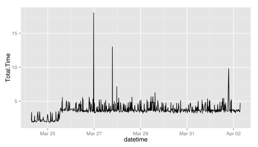 
---
.title2
# Summarise

---
.code

```r
requests_df %>% 
  filter(!is.na(Total.Time)) %>% 
  group_by(Agent) %>% 
  summarise(
    median = median(Total.Time),
      p_90 = quantile(Total.Time, 0.90),
      p_95 = quantile(Total.Time, 0.95),
      p_99 = quantile(Total.Time, 0.99),
      p_99.9 = quantile(Total.Time, 0.999),
      max = max(Total.Time)
    )
```

```
## Source: local data frame [6 x 7]
## 
##                     Agent median  p_90  p_95   p_99 p_99.9   max
## 1 Buenos Aires, Argentina  4.900 6.200 7.145 19.902 27.831 28.71
## 2               Hong Kong  4.030 5.787 6.701  9.141 21.017 29.06
## 3         London, England  4.420 5.350 5.670  6.202 24.665 25.67
## 4            New York, NY  3.560 4.470 4.860  5.547 12.634 18.00
## 5            San Jose, CA  4.330 5.190 5.655  7.331 13.487 15.74
## 6       Sydney, Australia  4.765 6.013 6.406  7.287  8.292  8.95
```
---
.title2

# Mutate

---


```r
requests_df %>%
  mutate(Total.Time.ms = Total.Time * 1000) %>% 
  ggplot(aes(Total.Time.ms)) +
  geom_histogram(binwidth=100)
```

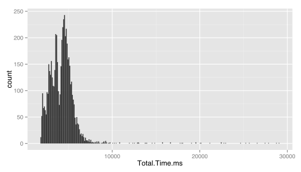 
---

arrange?

---
.title
# Summary statistics

---

## mean/standard deviation

---

## Five-number summary

1. min
2. lower quartile
3. median
4. upper quartile
5. max

---
.code

```r
mean(san_jose_requests$Total.Time)
```

```
## [1] 4.065
```

```r
sd(san_jose_requests$Total.Time)
```

```
## [1] 1.219
```

```r
summary(san_jose_requests$Total.Time)
```

```
##    Min. 1st Qu.  Median    Mean 3rd Qu.    Max. 
##    2.19    2.94    4.33    4.07    4.76   15.70
```

---
.title

# Latency

---
.code

```r
san_jose_requests %>%
  ggplot(aes(Agent, Total.Time)) + geom_boxplot() +
  geom_hline(aes(yintercept=mean(Total.Time), color="Mean", linetype="Mean"), size=1, show_guide=TRUE) +
  scale_colour_manual(name="", values=c(Mean="red")) +
  scale_linetype_manual(name="", values=c(Mean="dashed"), guide=FALSE)
```

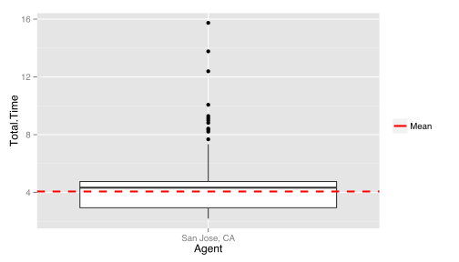 

---
.code

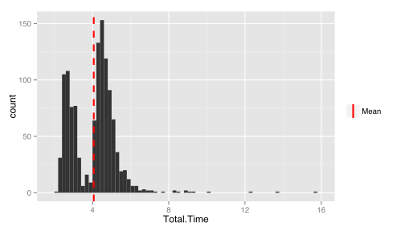 

---
.code


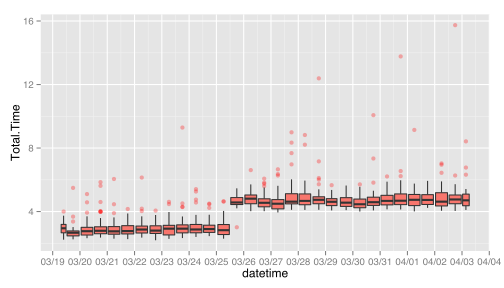 

---
.title

# Presentation

---
.title3
## R markdown

---
.image


---
.image

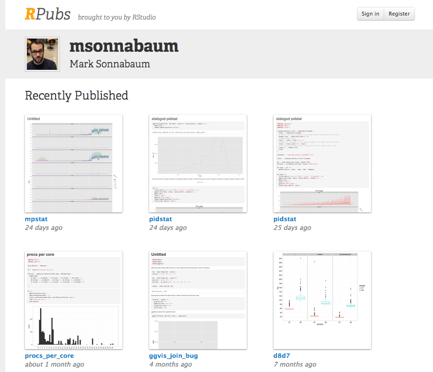

---

## ggvis

---
.references
# References

- https://github.com/hadley/dplyr
- https://github.com/hadley/tidyr
- https://github.com/hadley/ggplot2
- https://github.com/rstudio/ggvis

---
# THANKS

